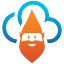

# Hi, I'm Thomas 👋

I'm a software developer from Germany with a strong focus on **.NET and C#** and a background in software architecture and technical leadership.

I work at [ Cloud Klabauter GmbH](https://cloudklabauter.de/), building cloud-based software and automation for the property-management industry.

### What I'm interested in

- 🏗️ Software architecture, distributed systems, and maintainable APIs
- 🧰 Developer tooling, automation, and a good developer experience
- 🤖 AI-assisted software development and agentic systems
- 🏠 Self-hosting, Home Assistant, and smart-home technology
- 🌍 Open source and sharing practical solutions

### Recent GitHub activity

<!--RECENT_ACTIVITY:start-->
<!--RECENT_ACTIVITY:source:14cbb6e451d39fd35df068fdeedbc49fe74b277339a2bb2dea8bd89b814dc3b5-->
1. 🔀 Opened a pull request that was later merged — [PR #1795](https://github.com/meziantou/Meziantou.Framework/pull/1795) in [meziantou/Meziantou.Framework](https://github.com/meziantou/Meziantou.Framework)
2. 🚫 Closed a pull request — [PR #4761](https://github.com/microsoft/agent-framework/pull/4761) in [microsoft/agent-framework](https://github.com/microsoft/agent-framework)
<!--RECENT_ACTIVITY:end-->

### Elsewhere

- [ Website and blog](https://thomasfreudenberg.com/)
- [ LinkedIn](https://www.linkedin.com/in/freudenberg/)
- [ X](https://x.com/thoemmi)
- [ Mastodon](https://mastodon.online/@thoemmi)
- [ Bluesky](https://bsky.app/profile/thomasfreudenberg.com)

When I'm away from the keyboard, you'll probably find me cycling in the Alps — ideally after sufficient coffee. 🚴☕
